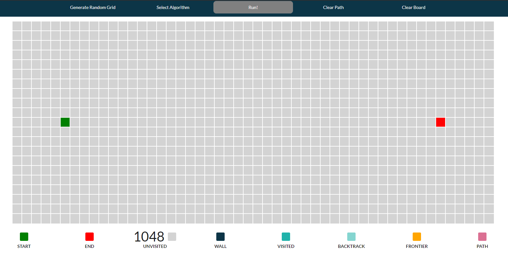
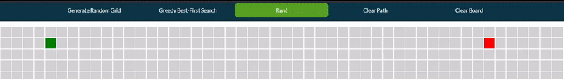

# Pathfinding Visualizer: About the Project
An interactive web application that helps users visualize search algorithms in a grid environment.

[Click here to try out the current deployed version](https://davidcwh.github.io/Pathfinding-Visualizer/)

## Built With
* [Create React App](https://create-react-app.dev/)
* [React JS](https://reactjs.org/)
* [React Redux](https://react-redux.js.org/)
* [Semantic UI React](https://react.semantic-ui.com/)

## Motivation: Why Web Application and Why Visualize Algorithms?

Being new to frontend web development, this project is an outlet for me to apply the web development knowledge I have learned during my current internship, and more importantly to gain experience in using the React JS and Redux libaries.

Furthermore, I have a personal interest in learning and understanding how different algorithms work. Having learned about basic uninformed search algorithms in year 1 and more recently informed search algorithms in year 2 of my Computer Science course at NUS, building a pathfinding visualizer helps to reinforce my understanding of them. 

In the past, I have greatly benefited from the use of similar, more polished algorithm visualization web applications so this idea is not novel, but I believe this project serves as a useful tool for my fellow Computing students in understanding the differences between different search algorithms, and hopefully aid in their learning as it did in mine.

## Aim
To provide a platform that 
* runs and visualize search algorithms, 
* highlights the differences between the search algorithms, and
* make learning about search algorithms more engaging through interactive elements.

## Application Layout

The layout of the web application had three main components:
* Menu panel
* 21 x 50 Grid
* Statistics panel

## Features

### Wall Creation
To toggle a wall node, click on an unvisited node. Holding down the mouse allows the user to toggle mulitple walls at once:

### Shift Start and End nodes 
Holding down and draging the Start/End nodes, Users are able to shift them before an algorithm run:

After an algorithm run, moving the Start or End node would recompute and render the resultant grid instantly. This allows users to see the difference in path taken/search space if the Start/End nodes were shifted:

### Algorithms
Currently there are four search algorithms available, two uninformed and two informed.

#### Breath First Search (BFS)
An uninformed search algorithm, BFS expands the shallowest unexpanded nodes first using a FIFO queue for the frontier. Any new path to a node that is already in the frontier or is visited is discarded, as a result, BFS always has the shallowest path to every frontier node and consequently guarantees the optimal path.

#### Depth First Search (DFS)
An uninformed search algorithm, DFS expands the deepest node in the current frontier of the search space. This is achieved with the use of LIFO queue (Stack) so that the most recently generated node is chosen for expansion. In this version of DFS, the neighbours of a node are pushed onto the stack in the following order: left, down, right, up. 

If a node has no neighbours, the search "backs up" to the next deepest node with unexplored neighbours at the top of the stack, and so the particular node with no neighbours is "backtracked" and not on the resultant path. Such nodes are marked as so on the grid.

DFS does not guarantee the optimal path.

#### A* Search
An informed search algorithm, A* (pronounced A Star) search evaluates nodes by taking the sum of _g(n)_, the cost of reaching node n, and _h(n)_, the estimated cost of the shortest path from n to the End node: _f(n)_ = _g(n)_ + _h(n)_.

Thus, _f(n)_ is the estimated cost of the cheapest path through node n. A* Search expands the nodes in the frontier with the lowest _f(n)_ value. For _h(n)_, the [Manhattan Distance heuristic](http://theory.stanford.edu/~amitp/GameProgramming/Heuristics.html#:~:text=Manhattan%20distance%23&text=For%20the%20best%20paths%2C%20and,and%20decrease%20h%20by%20D.) is used.

Since the Manhattan Distance heuristic is consistent, the A* Search guarantees the optimal path.

#### Greedy Best First Search
An informed search algorithm, Greedy best first search expands the node that is closest to the goal, based on the rationale that this will likely lead to a solution quickly. To do this, nodes are evaluated only by a heuristic function (_f(n)_ = _h(n_)), which is an estimation of the path between the node to the End node. In this version of Greedy search, the Manhattan Distance heuristic is used.

However, it does not guarantee the optimal path. This is because it does not take into consideration the cost of travelling to a node - it may be more costly to travel to a node that is closer to the End node than to travel to another node that is futher away from the End node. 

### Pause/Resume Algorithm Run
Users can pause and resume an algorithm midway through its run:

### Real Time Statistics
Number of each type of node is displayed and updated in real time as an algorithm is ran:

The purpose of the statistics board is not purely for aesthetics; the number of certain type of nodes carry some significance in analysing each algorithm's performance:
| Node Type     | Significance    |
|:--------:|--------|
| Visited     | The search space explored by the algorithm. This serves as a metric for time complexity of the algorithm. This is because the longer the algorithm runs, the more nodes are expanded and explored.    |
| Frontier     | The maximum number of nodes in the frontier during a run serves as a metric for space complexity of the algorithm. This is because the frontier contains the bulk of the nodes generated by the algorithm at any point of time and so its size is a good estimation of the space needed.   |
| Path     | Shows the length of the resultant path returned by the algorithm between the Start and End node. An optimal path would have the shortest length of every path between the Start and End nodes.   |

### Random Wall Generation
If manually drawing wall nodes is too time/effort consuming, users can generate a grid with randomly placed wall nodes:

### Grid Clearance
Users are able to clear the entire grid, or just clear all nodes excepts for walls - useful when running multiple algorithms on the same grid wall configuration:

## Future Expansion
I have these ideas in mind that either further expand the existing features or are new features themselves.

### Add More Search Algorithms
Possible additions are:
* Depth Limited Search (DLS)
* Iterative Deepening Search (IDS)
* Dijkstra
* Add more heurtistics for informed search algorithms and allow users to switch between them.

### Add Weighted Nodes
Currently it costs 1 step to travel from a node to any of its neighbours. Adding Weighted nodes that cost more to travel through would highlight how different algorithms behave if travel costs are not uniform. (E.g. BFS would not guarantee the optimal path if travel costs are not uniform)

### Recursive Maze Generation
Implement recursive maze generation algorithms to generate mazes:

### Toggle Wall Probability in Random Wall Generation
Currently in the random wall generation feature, the probability of a node being toggled as a wall is 0.3 as I found it to produce the right balance of walls and explorable search space. Further expansion would be to allow users to adjust this probability for greater flexiblity when experimenting with different obstacle density.

### Toggle Algorithm Run Speed
Ability to make algorithm runs slower allows users to better follow its progress through the grid.